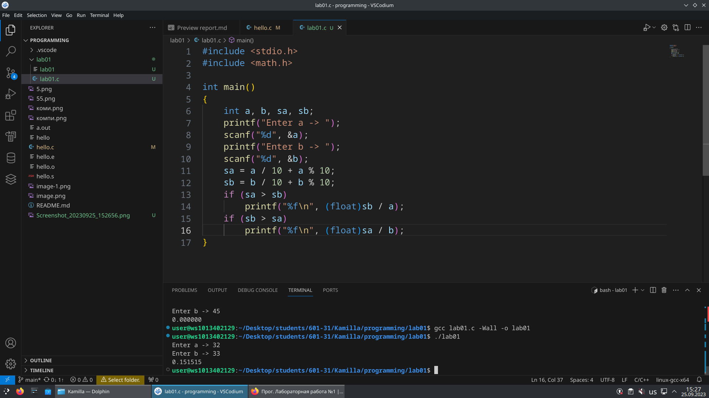
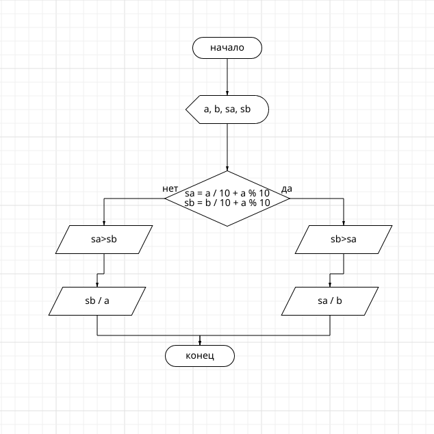

# Лабораторная работа №1

## Задания

### 1. Разберите код программы из примера
### 2. Составьте блок-схему алгоритма для своего варианта.
### 3. Напишите программу, решающую задачу по своему варианту.
### 4. Оформите отчёт в README.md. Отчёт должен содержать:

    Задание
    Описание проделанной работы
    Скриншоты результатов
    Блок-схему
    Ссылки на используемые материалы

### 1. Разобрала программу 
### 2. По моему варианту 7, выпало задание : 
#### Вывести частное наименьшей суммы цифр параметров a, b и второго параметра.

### 3. И составила блок-схему 

## И вот вы прочитали мой отчет
