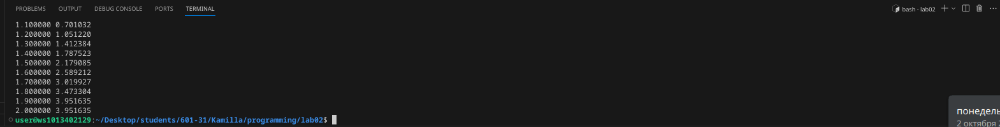

# Лабораторная работа №2

## Задания

### 1. Напишите программу по варианту, используя оператор цикла while (нечётные варианты) или do while (чётные варианты).
### 2. Напишите программу, используя оператор цикла for.
### 3. Постройте график с использованием gnuplot.
### 4. Составьте блок-схемы.
### 5. Оформите отчёт в README.md. Отчёт должен содержать:

    Задание
    Описание проделанной работы
    Скриншоты результатов
    Блок-схему
    График функции
    Ссылки на используемые материалы

# Выполнение работы
### По моему варианту 7 выпало задание:


$$ f(x) =
  \begin{cases}
    {e^{-2\sin(x)}},       & \ -1\leq x \leq 1\\
    {x^2} - \cot(x),      & \  1\leq x \leq 2\  \end{cases}
$$


### 1. По моему варианту 7, используя оператора цикла while, написала программу

```

#include <stdio.h>
#include <math.h>

int main()
{
    double x, y, s;
    x = 0.0; 
    scanf("%lf", &s); 
    double n = 2 / s + 1;
    while (n) 
   {
        if (x >= -1 && x <= 1)
          y = exp(-2*sin(x));
        if (x > 1 && x <= 2)
          y = x*x - cos(x)/sin(x);
         printf("%lf %lf\n", x, y);
        x += s;
        n = n-1;
   }

}

```

 ## Ввела  в терминал 

 ```
  gcc lab02.c -Wall -lm 

```

```
 ./a.out

 ```

 #### С шагом 0.1 




### 2. Напиcала программу, используя оператор цикла for

```
#include <stdio.h>
#include <math.h>
#include <stdlib.h>

int main()
{
    double x, y, s;
    x = 0.0; 
    scanf("%lf", &s);
    int n, i;
    n = 2 / s;
    for (i = 0; i <= n; i++)  
    {
        if (x >= -1 && x <= 1)
          y = exp(-2*sin(x));
        if (x > 1 && x <= 2)
          y = x*x - cos(x)/sin(x);
         printf("%f %f\n", x, y);
        x += s;
    }

}

```
 Ввела  в терминал 

 ```
  gcc lab02.c -Wall -lm 

```
```
 ./a.out

 ```
 #### С шагом 0.1 


и мне выдало такой результат


### 3. Построила график с использованием gnuplot
 
#### Для этого я ввела новый файл plot.gpi, где написала данный код:

```
#!/usr/bin/env -S gnuplot -persist
# set terminal png enhanced
# set output "my_graph.png"
set xlabel "x" 
set ylabel "f(x)"
set grid
set title "График функции f(x)"
plot "my_graph.txt" with lines title "f(x)"

```
### и мне вывело этот график


### 4. Сделала блок-схему по программе


## И вот цитатка, если вы программируете и у вас не получается как у меня(((
 


